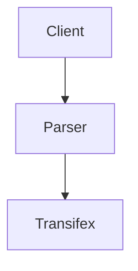

# transifex_interview

The application is asynchronous in order to be efficient in case more than one resource is requested.

## Pipeline
The pipeline use a client, a parser and a transifex client and creates/updates a resource.

It can be used many pipelines asynchronously in order to be efficient.
The client can be any client in this case the trivia client. The parser
can be any parser in this case trivia parser. The transifex client is the transifex client. 

