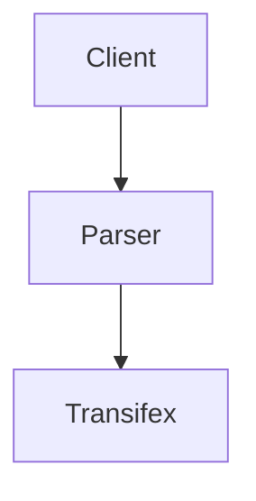

# transifex_interview

The app is asynchronous in order to manage multiple categories.

## Pipeline
The abscraction
a pipeline is used which take the data parse them and send it to a resource.
The programm run asynchronous multiple pipelines.

