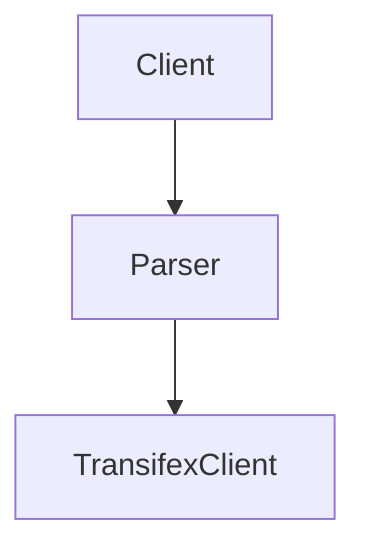

# Transifex Interview

## Design
- The Client is responsible for connecting and receiving the corresponding data from an endpoint.
- The Parser is responsible for the parsing of this data.
- The Transifex Client is responsible for communicating with the transifex api.
- The Pipeline class is responsible for creating/updating a resource. 



Each pipeline is executed asynchronously and using the run_pipelines class method multiple pipelines are executed in parallel.

Any combination of a client and a parser can be used to create a pipeline. Thus, the design is modular and allows the possibility to change the parser and add other clients.


## Implementation
The application uses the FastAPI backend framework and the uvicorn asgi server.
In order to run it:
```cmd
uvicorn main:app --host 0.0.0.0 --port 8000
```

The application has an endpoint for creating or updating a resource. The client has to provide a list of categories and the application creates the pipelines and executes them in parallel. A cli tool is developed under the cli folder.
```cmd
python client.py
```

## Testing, Docker and CI/CD pipeline
The application is dockerized.
```cmd
docker build -t image_name .
docker run -d --name container_name -p 8000:8000 image_name
```
Using github actions the application is tested and deployed to a private dockerhub registry.
For unnitests the pytest library is used.
```cmd
pytest
```

## More Info
- I didn't use environment variables for my account to keep the solution simple.
- Only the parser class has unittests, the test_app file has a test which tests the endpoint
  of the application without mocking. Mocking must be implement for the external apis.
